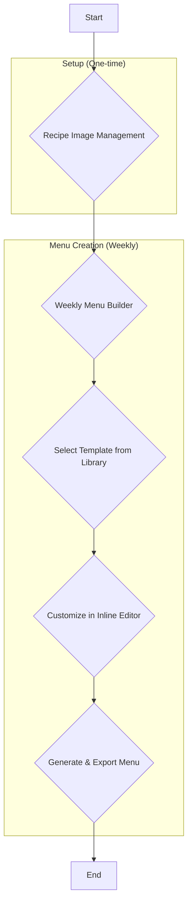

# Weekly Menu Creation Feature Specification

**Author:** Manus AI  
**Date:** November 5, 2025

## 1. Introduction

This document outlines the requirements, design, and implementation plan for a comprehensive **Weekly Menu Creation** feature for the Recipe Costing Application. This feature is designed specifically for tiffin services to streamline their menu creation process, from managing recipe images to generating beautiful, professional menus with Canva integration.

### 1.1. Project Goals

- **Simplify Menu Creation:** Provide an intuitive, step-by-step process for creating weekly menus.
- **Enhance Visual Appeal:** Integrate with Canva to produce stunning, high-quality menu templates.
- **Increase Efficiency:** Automate repetitive tasks like menu design and layout.
- **Empower Customization:** Allow users to personalize templates with an inline editor.
- **Centralize Assets:** Create a dedicated image management system for recipes.

### 1.2. Target Audience

- **Tiffin Service Owners:** Small to medium-sized businesses providing daily or weekly meal services.
- **Home Chefs:** Individuals running a home-based tiffin service.
- **Caterers:** Businesses offering weekly meal plans.

---

## 2. Feature Overview

This feature will be a complete ecosystem for menu creation, consisting of four main pages:

| Page | Description | Key Features |
|---|---|---|
| **1. Recipe Image Management** | Upload, crop, and manage images for each recipe. | - Multi-image upload per recipe - Image cropper with fixed aspect ratio - Set default image for menus - Image gallery view |
| **2. Weekly Menu Builder** | Create a 6-day weekly menu by selecting items for each day. | - Day-wise item selection (Mon-Sat) - Categorized item selection (Sabzi, Dal, Rice, etc.) - Real-time menu preview - Save and load weekly menus |
| **3. Template Library** | Discover, import, and manage Canva menu templates. | - Browse free Canva templates - Import templates by URL - Set default template for menus - Search and filter templates |
| **4. Inline Template Editor** | Customize menu templates with an intuitive inline editor. | - Edit text (size, font, color) - Rearrange elements (images, text, banners) - Change background colors/images - Real-time preview of changes |

### 2.1. User Flow Diagram

---
## 3. Detailed Feature Specifications

### 3.1. Recipe Image Management

**Purpose:** To provide a centralized system for managing high-quality images for each recipe, ensuring menus are visually appealing.

**Page Layout:**
- **Left Panel:** List of all recipes.
- **Right Panel:** Image gallery for the selected recipe.

**Key Features:**

- **Multi-Image Upload:**
  - Users can upload up to 5 images per recipe.
  - Drag-and-drop upload area.
  - Supported formats: JPG, PNG, WEBP.

- **Image Cropper:**
  - After upload, an image cropper modal appears.
  - **Fixed aspect ratio of 1:1 (square)** to ensure consistency in menus.
  - Users can zoom and pan to crop the perfect shot.

- **Default Image Selection:**
  - For each recipe, users can select one image as the **default** for menus.
  - A "Default" badge will be displayed on the selected image.

- **Image Gallery:**
  - Displays all images for the selected recipe.
  - Delete button on each image.
  - Hover-to-preview zoom effect.

**Technical Implementation:**
- **Frontend:** React with a library like `react-image-crop`.
- **Backend:** API endpoints for image upload, storage, and retrieval.
- **Storage:** Images will be stored on the server in a dedicated `uploads/recipe_images` folder.

### 3.2. Weekly Menu Builder

**Purpose:** To provide a fast and intuitive way to build a 6-day weekly menu.

**Page Layout:**
- **Top:** Week selector (e.g., "November 4-9, 2025").
- **Main Area:** Six cards, one for each day (Monday to Saturday).

**Key Features:**

- **Day-wise Item Selection:**
  - Each day card has buttons to "Add Sabzi", "Add Dal", "Add Rice", etc.
  - Clicking a button opens a modal with a list of available recipes in that category.
  - Users can select one or more items.

- **Categorized Selection:**
  - Items will be categorized for easy selection:
    - **Sabzi:** (e.g., Paneer Butter Masala, Aloo Gobi)
    - **Dal/Kadhi:** (e.g., Dal Tadka, Gujarati Kadhi)
    - **Rice:** (e.g., Jeera Rice, Veg Pulao, Khichdi)
    - **Roti/Paratha:** (e.g., Plain Roti, Aloo Paratha)
    - **Special Items:** (e.g., Samosa, Dhokla, Gulab Jamun)

- **Real-time Menu Preview:**
  - As items are added, they appear in the day card.
  - A small preview of the menu template will be updated in real-time.

- **Save/Load Weekly Menus:**
  - Users can save a completed weekly menu for future use.
  - A "Load Previous Menu" button will allow them to quickly populate the builder.

### 3.3. Template Library

**Purpose:** To provide a curated library of beautiful, professional Canva templates that users can import and use for their menus.

**Page Layout:**
- **Top:** Search bar and filter dropdown.
- **Main Area:** Grid of template thumbnails.

**Key Features:**

- **Browse Free Canva Templates:**
  - The library will be pre-populated with a selection of high-quality, free Canva templates suitable for tiffin menus.
  - Integration with Canva API to fetch these templates.

- **Import Templates by URL:**
  - Users can import their own Canva templates by pasting the template URL.

- **Set Default Template:**
  - Users can select one template as the **default** for all new menus.

- **Search and Filter:**
  - Search by keyword (e.g., "Diwali", "Modern", "Minimalist").
  - Filter by style, color, or orientation.

### 3.4. Inline Template Editor

**Purpose:** To provide a powerful yet user-friendly inline editor for customizing menu templates without leaving the application.

**Page Layout:**
- **Center:** Large canvas displaying the selected menu template.
- **Left Panel:** Layers and elements list.
- **Right Panel:** Properties inspector for the selected element.

**Key Features:**

- **Direct Manipulation:**
  - Click and drag to move elements (images, text boxes).
  - Resize elements by dragging the corners.

- **Text Editing:**
  - Double-click to edit text directly on the canvas.
  - Properties inspector allows changing:
    - Font family, size, and color
    - Bold, italic, underline
    - Alignment

- **Image Replacement:**
  - Click on an image to open the recipe image gallery and replace it.

- **Color Customization:**
  - Change background colors, text colors, and shape colors.

- **Real-time Preview:**
  - All changes are reflected instantly on the canvas.

**Technical Implementation:**
- This is the most complex feature. We can start with a basic editor and add more features over time.
- We can use a library like `fabric.js` or build a custom editor using the HTML5 Canvas API.
- Integration with Canva API to load and save template modifications.

---
## 4. Recommendations & Feature Enhancements

Based on industry best practices and the goal of creating a powerful, user-friendly tool, I recommend the following enhancements to make this feature even more effective.

### 4.1. UX & Workflow Improvements

| Recommendation | Description | Benefit |
|---|---|---|
| **Drag-and-Drop Menu Builder** | Instead of clicking buttons to add items, allow users to drag recipes from a sidebar library and drop them onto the desired day. | Faster, more intuitive, and more engaging user experience. |
| **Automatic Cost Calculation** | As items are added to the weekly menu, the total cost for each day and the entire week should be calculated and displayed in real-time. | Provides immediate financial insight and helps in pricing decisions. Leverages the core costing feature of the app. |
| **AI-Powered Menu Suggestions** | An "Auto-Generate Menu" button that suggests a balanced, cost-effective, and varied menu for the week based on past selections and recipe popularity. | Saves significant time and mental effort for the user. Adds a "smart" feature that provides a competitive advantage. |
| **Print-Friendly Version** | Generate a clean, black-and-white, print-friendly version of the menu for internal kitchen use. | Improves kitchen efficiency and reduces errors. |

### 4.2. Technical & Performance Enhancements

| Recommendation | Description | Benefit |
|---|---|---|
| **Use Canva SDK for Editor** | For the inline editor, integrate the full **Canva SDK** instead of just using the API. This embeds the familiar Canva editor directly into our application. | Provides a complete, professional editing experience that users are already familiar with. Reduces our development time significantly. |
| **Automated Image Optimization** | When a user uploads a recipe image, automatically compress and resize it to a standard web-friendly format (e.g., 1080x1080 WEBP). | Faster menu loading times for customers, and reduced server storage costs. |
| **Database Caching** | Cache frequently accessed data, such as the recipe list and templates, to improve performance. | Faster page loads and a more responsive user interface. |

### 4.3. New Feature Suggestions

| Feature | Description | Benefit |
|---|---|---|
| **Ingredient Shopping List** | Automatically generate a consolidated shopping list of all ingredients and quantities required for the entire week's menu. | **Game-changer for tiffin services.** Saves hours of manual work, reduces food waste, and streamlines purchasing. |
| **Shareable Menu Link & QR Code** | Generate a unique, public URL for each weekly menu. Also, generate a QR code that links to this URL, which can be added to the menu design. | Easy sharing with customers via WhatsApp, social media, or websites. The QR code is perfect for print marketing. |
| **Social Media Export** | Allow exporting the final menu image in different aspect ratios optimized for social media (e.g., Instagram Post 1:1, Instagram Story 9:16). | Simplifies marketing efforts and ensures menus look great on all platforms. |
| **Customer Feedback Integration** | Add a small section to the shareable menu link where customers can rate the menu or leave comments. | Provides valuable feedback for improving future menus and customer satisfaction. |

---

## 5. Database Schema Design

To support these features, the following new tables will be added to the database.

### `recipe_images`

| Column | Data Type | Description | Constraints |
|---|---|---|---|
| `id` | INT | Primary Key | AUTO_INCREMENT, PRIMARY KEY |
| `recipe_id` | INT | Foreign key to `recipes` table | NOT NULL, FOREIGN KEY |
| `image_url` | VARCHAR(255) | URL/path to the image file | NOT NULL |
| `is_default` | BOOLEAN | Whether this is the default image for the recipe | NOT NULL, DEFAULT 0 |
| `created_at` | TIMESTAMP | Timestamp of creation | DEFAULT CURRENT_TIMESTAMP |

### `weekly_menus`

| Column | Data Type | Description | Constraints |
|---|---|---|---|
| `id` | INT | Primary Key | AUTO_INCREMENT, PRIMARY KEY |
| `user_id` | INT | Foreign key to `users` table | NOT NULL, FOREIGN KEY |
| `week_start_date` | DATE | The Monday of the menu week | NOT NULL |
| `name` | VARCHAR(255) | A name for the menu (e.g., "Diwali Special Week") | NULLABLE |
| `created_at` | TIMESTAMP | Timestamp of creation | DEFAULT CURRENT_TIMESTAMP |

### `weekly_menu_items`

| Column | Data Type | Description | Constraints |
|---|---|---|---|
| `id` | INT | Primary Key | AUTO_INCREMENT, PRIMARY KEY |
| `weekly_menu_id` | INT | Foreign key to `weekly_menus` table | NOT NULL, FOREIGN KEY |
| `day_of_week` | TINYINT | Day of the week (1=Mon, 2=Tue, etc.) | NOT NULL |
| `recipe_id` | INT | Foreign key to `recipes` table | NOT NULL, FOREIGN KEY |
| `category` | VARCHAR(50) | e.g., "Sabzi", "Dal", "Rice" | NOT NULL |

### `canva_templates`

| Column | Data Type | Description | Constraints |
|---|---|---|---|
| `id` | INT | Primary Key | AUTO_INCREMENT, PRIMARY KEY |
| `user_id` | INT | Foreign key to `users` table (for custom imports) | NULLABLE |
| `template_name` | VARCHAR(255) | Name of the template | NOT NULL |
| `canva_template_id` | VARCHAR(255) | The ID of the template from Canva | NOT NULL, UNIQUE |
| `thumbnail_url` | VARCHAR(255) | URL for the template thumbnail | NOT NULL |
| `is_default` | BOOLEAN | Whether this is the user's default template | NOT NULL, DEFAULT 0 |
| `created_at` | TIMESTAMP | Timestamp of creation | DEFAULT CURRENT_TIMESTAMP |

---

## 6. Canva Integration Strategy

Canva provides a powerful API and SDK that we can leverage to integrate menu template creation directly into the application. This section outlines the integration approach.

### 6.1. Canva API Overview

Canva offers the following integration options:

| Integration Type | Description | Use Case for Our App |
|---|---|---|
| **Canva Connect API** | Allows programmatic creation, editing, and exporting of designs. | Backend integration for generating and exporting final menus. |
| **Canva Embed SDK** | Embeds the Canva editor directly into our application as an iframe. | Inline Template Editor - provides a full-featured editor without building from scratch. |
| **Canva Button** | A "Design with Canva" button that opens Canva in a new tab. | Not suitable for our use case as it breaks the user flow. |

For our application, we will use a **combination of the Canva Connect API and the Canva Embed SDK**. The Connect API will handle backend operations such as fetching templates and exporting final designs, while the Embed SDK will power the Inline Template Editor.

### 6.2. Authentication & Authorization

Canva uses OAuth 2.0 for authentication. The user will need to authorize our application to access their Canva account. This is a one-time process, and the access token will be stored securely in the database for future use.

**Implementation Steps:**
1. Register the application on the Canva Developer Portal to obtain a Client ID and Client Secret.
2. Implement an OAuth flow in the application to allow users to authorize access.
3. Store the access token and refresh token securely in the database.
4. Use the access token to make API calls on behalf of the user.

### 6.3. Template Discovery & Import

The Template Library page will use the Canva Connect API to fetch a curated list of free templates suitable for tiffin menus. Users can also import their own templates by providing a Canva design URL.

**API Endpoints:**
- `GET /v1/designs` - List designs in the user's Canva account.
- `GET /v1/designs/{id}` - Get details of a specific design.

### 6.4. Inline Editor Integration

The Inline Template Editor will use the **Canva Embed SDK** to embed the full Canva editor directly into our application. This provides a seamless editing experience without the need to build a custom editor from scratch.

**Implementation Steps:**
1. Load the Canva Embed SDK in the React component.
2. Initialize the editor with the selected template ID.
3. Provide callbacks to handle save and export actions.
4. Automatically populate the template with menu data (recipe names, images, prices).

### 6.5. Menu Export & Sharing

Once the user has finalized the menu design, the application will use the Canva Connect API to export the design as a high-resolution image (PNG or JPG).

**API Endpoints:**
- `POST /v1/exports` - Create an export job for a design.
- `GET /v1/exports/{id}` - Check the status of an export job and retrieve the download URL.

The exported image can then be:
- Downloaded to the user's device.
- Shared directly via WhatsApp or social media.
- Embedded on a website or sent via email.

---

## 7. Implementation Plan

This section provides a phased approach to implementing the Weekly Menu Creation feature.

### Phase 1: Foundation (Weeks 1-2)

**Goal:** Set up the database, API endpoints, and basic UI structure.

**Tasks:**
1. Create the four new database tables (`recipe_images`, `weekly_menus`, `weekly_menu_items`, `canva_templates`).
2. Develop API endpoints for CRUD operations on these tables.
3. Create the basic page structure and navigation for all four pages.
4. Set up Canva OAuth integration and store credentials.

### Phase 2: Recipe Image Management (Week 3)

**Goal:** Complete the Recipe Image Management page.

**Tasks:**
1. Implement multi-image upload with drag-and-drop.
2. Integrate an image cropper library (e.g., `react-image-crop`).
3. Build the image gallery view with default selection.
4. Test the upload, crop, and delete workflows.

### Phase 3: Weekly Menu Builder (Weeks 4-5)

**Goal:** Complete the Weekly Menu Builder page.

**Tasks:**
1. Create the day-wise card layout.
2. Implement the categorized item selection modal.
3. Add real-time menu preview.
4. Implement save and load functionality for weekly menus.
5. Add automatic cost calculation for each day and the entire week.

### Phase 4: Template Library (Week 6)

**Goal:** Complete the Template Library page.

**Tasks:**
1. Use the Canva Connect API to fetch a curated list of templates.
2. Implement the template import by URL feature.
3. Build the search and filter functionality.
4. Add the ability to set a default template.

### Phase 5: Inline Template Editor (Weeks 7-8)

**Goal:** Complete the Inline Template Editor.

**Tasks:**
1. Integrate the Canva Embed SDK.
2. Implement automatic data population (recipe names, images, prices).
3. Add save and export functionality.
4. Test the end-to-end menu creation and export workflow.

### Phase 6: Enhancements & Polish (Week 9)

**Goal:** Add recommended enhancements and polish the user experience.

**Tasks:**
1. Implement drag-and-drop menu builder.
2. Add AI-powered menu suggestions (optional, if time permits).
3. Create shareable menu links and QR codes.
4. Add social media export options.
5. Conduct thorough testing and bug fixing.

### Phase 7: Documentation & Launch (Week 10)

**Goal:** Prepare for launch.

**Tasks:**
1. Create comprehensive user documentation.
2. Record video tutorials for each feature.
3. Conduct user acceptance testing with a small group of tiffin service owners.
4. Deploy to production and announce the launch.

---

## 8. Technical Considerations

### 8.1. Image Storage & Optimization

Recipe images will be stored on the server in a dedicated folder. To ensure fast loading times and reduce storage costs, all uploaded images will be automatically optimized:

- **Format:** Convert to WEBP for better compression.
- **Size:** Resize to a maximum of 1080x1080 pixels.
- **Quality:** Set compression quality to 85% to balance quality and file size.

### 8.2. Security & Privacy

Since this feature involves user-generated content and integration with a third-party service (Canva), security is paramount:

- **Image Upload Validation:** Validate file types and sizes on both the client and server.
- **OAuth Token Storage:** Store Canva access tokens securely using encryption.
- **Rate Limiting:** Implement rate limiting on API endpoints to prevent abuse.
- **User Permissions:** Ensure users can only access and modify their own menus and images.

### 8.3. Performance Optimization

To ensure a smooth user experience, especially when dealing with images and real-time previews:

- **Lazy Loading:** Load images only when they are visible on the screen.
- **Caching:** Cache frequently accessed data such as recipe lists and templates.
- **Debouncing:** Debounce search and filter inputs to reduce unnecessary API calls.
- **Progressive Image Loading:** Display a low-resolution placeholder while the high-resolution image loads.

---

## 9. Success Metrics

To measure the success of this feature, we will track the following metrics:

| Metric | Target | Description |
|---|---|---|
| **Adoption Rate** | 70% of active users | Percentage of users who create at least one weekly menu within the first month. |
| **Time to Create Menu** | < 10 minutes | Average time taken to create a complete weekly menu from start to finish. |
| **Menu Shares** | 50+ per week | Number of menus shared via the shareable link feature. |
| **User Satisfaction** | 4.5/5 stars | Average rating from user feedback surveys. |
| **Canva Integration Usage** | 80% of menus | Percentage of menus created using Canva templates. |

---

## 10. Conclusion

The Weekly Menu Creation feature represents a significant enhancement to the Recipe Costing Application, transforming it from a simple costing tool into a comprehensive business management platform for tiffin services. By integrating with Canva and providing an intuitive, step-by-step workflow, we empower users to create stunning, professional menus in minutes.

This feature not only saves time and effort but also enhances the visual appeal and marketing potential of tiffin services. With the recommended enhancements such as automatic cost calculation, AI-powered suggestions, and shareable menu links, this feature has the potential to become the **killer feature** that sets our application apart from competitors.

The phased implementation plan ensures a structured approach to development, allowing for iterative testing and refinement. By the end of the 10-week timeline, we will have a robust, production-ready feature that delights users and drives business growth.

---

**Next Steps:**
1. Review and approve this specification document.
2. Begin Phase 1 implementation (database and API setup).
3. Set up a Canva Developer account and obtain API credentials.
4. Schedule regular progress reviews and user testing sessions.

---

*This document is a living specification and will be updated as the feature evolves during development.*
